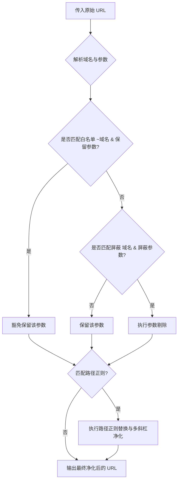

# NodeSeekX 链接净化 DSL (Domain Specific Language) 规范

NodeSeekX 链接净化器（Link Purifier）采用了一套轻量、声明式的**领域特定语言 (DSL)** 规则引擎，允许用户极其直观、灵活地定制 URL 参数及路径过滤规则。本篇文档将详细阐述该 DSL 规则引擎的语法结构、匹配机制以及线上配置最佳实践。

---

## 📖 核心设计思想

* **分权而治**：过滤规则分为**全局规则**与**局域规则**，支持精准控制。
* **白名单豁免**：提供强悍的白名单（Exemption）机制，确保开发人员/普通用户的关键参数（如 Telegram 的 `/start`、GitHub 的 `ref` 等）不会被误杀。
* **参数与路径双管齐下**：不仅能清洗 `URLSearch` 参数（`?key=val`），还能通过强大的正则表达式剔除 `URLPath` 中夹杂的垃圾跟踪痕迹。

---

## 🛠️ 语法元素与规程

净化规则采用纯文本输入，每行代表一个独立的语法块。主要分为四种类型的语句：

### 1. 注释与空行
任何以 `#` 开头的行都会被解析器当做注释并自动跳过。空行也会被忽略。
```text
# 这是一行有益的注释
```

### 2. 宏定义 (Macros)
* **语法格式**：`@宏名 = 参数1, 参数2, ...`
* **作用说明**：声明一个宏，它代表一组可以复用的参数列表。当在后续的规则中引用 `@宏名` 时，解析器会自动将其平铺展开。
* **实例**：
  ```text
  @utm    = utm_source, utm_medium, utm_campaign, utm_content, utm_term
  @ad_ids = ad_id, clickid, gclid, fbclid
  ```

### 3. 参数过滤规则 (Block Rules)
* **语法格式**：`作用域域名1 作用域域名2 ... >> 净化参数1, 净化参数2, ...`
* **作用说明**：当链接的域名匹配指定的作用域域名（支持多个域名以空格分隔）时，清除指定的参数。
* **核心匹配符**：
  * `*`：匹配**任意**字符。
    * 比如：`* >> @utm` 代表在所有域名下清洗 `@utm` 宏包含的所有参数（**全局过滤**）。
    * 比如：`*.youtube.com >> *` 代表清洗该域名下的**所有**查询参数（谨慎使用）。
    * 比如：`*.bilibili.com >> share_*` 代表清洗该域名下所有以 `share_` 开头的查询参数。
* **实例**：
  ```text
  # 将 YouTube 和 YouTu.be 的 si、feature 等参数剔除
  *.youtube.com youtu.be >> si, feature, pp
  ```

### 4. 正则表达式路径过滤 (Path Regex Block)
* **语法格式**：`作用域域名 >> /正则表达式/`
* **作用说明**：对于像 Amazon 这种不使用 `?key=val`，而是喜欢把跟踪痕迹写入到 URL 路径（Path）里的行为，可以通过正则表达式进行清洗。当域名匹配作用域时，链接的 `pathname` 部分中匹配正则表达式的内容会被**彻底抹除**，且多余的连续斜杠（如 `//`）会被自动净化为单斜杠 `/`。
* **实例**：
  ```text
  # 剔除 Amazon URL 中形如 /ref=xxx 的路径追踪段
  *.amazon.com >> /\/ref=[^\/]+/
  ```

### 5. 豁免/白名单机制 (Allow Rules)
* **语法格式**：`~作用域域名1 ~作用域域名2 ... >> 保留参数1, 保留参数2, ...`
* **作用说明**：以 `~` 开头的作用域代表**豁免（白名单）**。即使在全局规则（如 `* >> ...`）中声明要剔除某个参数，只要链接域名匹配了这里的豁免作用域，对应的参数就会被**强制保留**。这在防误杀设计中起到了至关重要的作用。
* **实例**：
  ```text
  # 全局屏蔽了 @invite (其中包含 ref 键)，但强制在 GitHub 和 Gitee 下保留 ref 键
  ~github.com ~gitee.com >> ref
  
  # 全局屏蔽了 start 键，但强制在 Telegram 下保留 start 启动参数
  ~t.me ~telegram.me >> start
  ```

---

## 🔍 URL 匹配与解析优先级

在执行净化流程时，底层的规则匹配逻辑具有严格的科学层次：



* **域名判定原则**：域名匹配 `s === '*'` 代表任意匹配，或者满足域名完全一致（`t === s`），亦或是子域名一致（`t.endsWith('.' + s)`）。如：`*.youtube.com` 会完美匹配 `www.youtube.com` 和 `music.youtube.com`。
* **双通道清洗**：
  * 通道一：清洗 `URL.search`（正常的 `?` 后缀参数）。
  * 通道二：清洗 `URL.hash` 内嵌套的查询段（如 `https://example.com/#/route?spm=xxx` 中的 hash 内置参数）。

---

## 📄 线上默认规则一览

以下是 NodeSeekX 出厂自带的最佳实践默认 DSL 配置，可直接作为参考与二次拓展的基础：

```text
# ── 宏定义 ──
@utm     = utm_source, utm_medium, utm_campaign, utm_content, utm_term
@ad_ids  = ad_id, clickid, gclid, fbclid, sc_cid
@invite  = ic, invite, invitation, invited_by, ref, referral, referrer
@aff     = aff, affiliate, partner, promo, promocode, coupon, subid, affid, aff_id
@track   = aid, pid, cid, tid, sid, uid, ref_id, tag
@channel = via, from, source, campaign, channel

# ── 全局过滤 ──
* >> @utm, @ad_ids, @invite, @aff, @track, @channel

# ── YouTube ──
*.youtube.com youtu.be >> si, feature, pp

# ── B站 ──
*.bilibili.com b23.tv >> spm_id_from, from_source, from_spmid, from, seid, share_source, share_medium, share_plat, share_tag, share_session_id, share_from, bbid, ts, timestamp, unique_k, rt, tdsourcetag, spm, vd_source, trackid

# ── Amazon Path 正则 ──
*.amazon.com >> /\/ref=[^\/]+/

# ── 豁免 (防误杀) ──
~github.com ~gitlab.com ~gitee.com >> ref
~t.me ~telegram.me >> start
```
